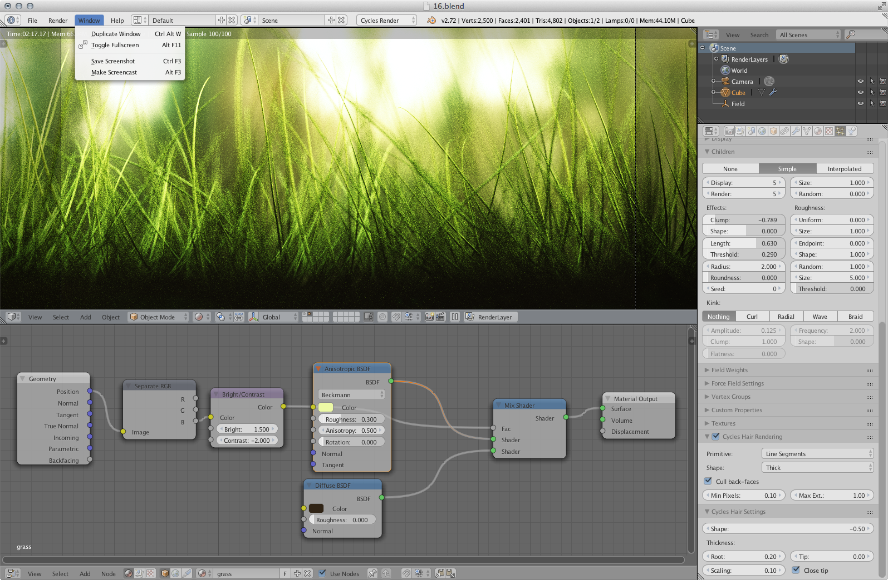
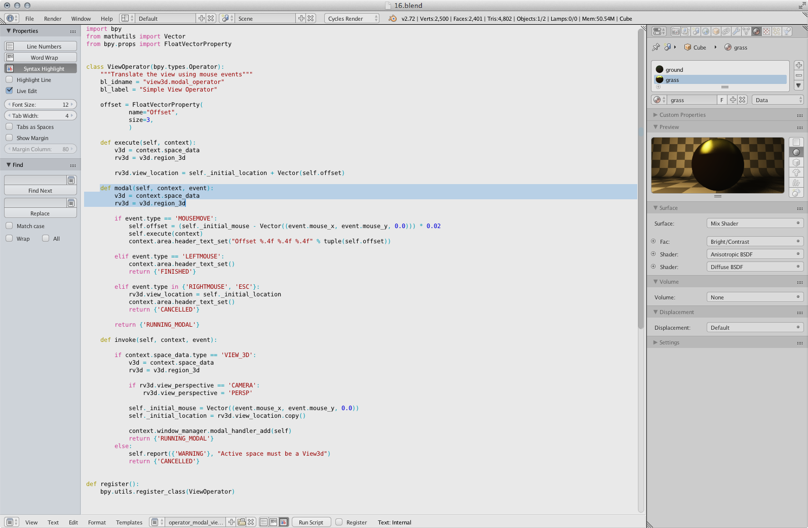

###A collection of themes for Blender
=============

**Modern:**
A faithful theme that gives the default Blender a more clean look.

**OSX:**
A soft theme that mimics how Mac OS X looks without using pure white.

#### To use the themes:
1. Download the xml file.
2. In Blender, go to **File** > **User Preferences** > **Themes**
3. Click on **Install Theme** at the bottom and browse for the xml file.
4. Enjoy!
